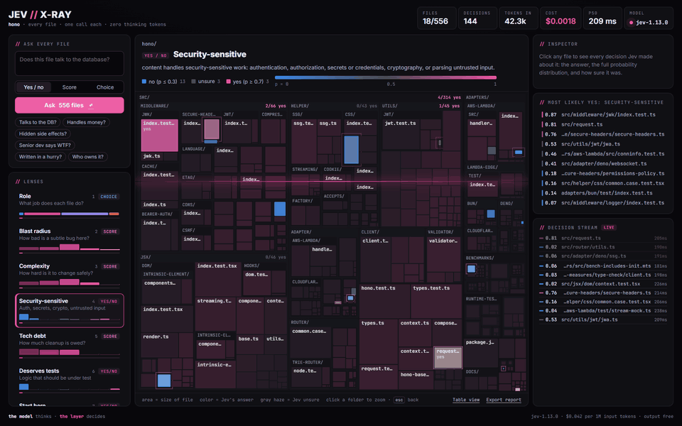
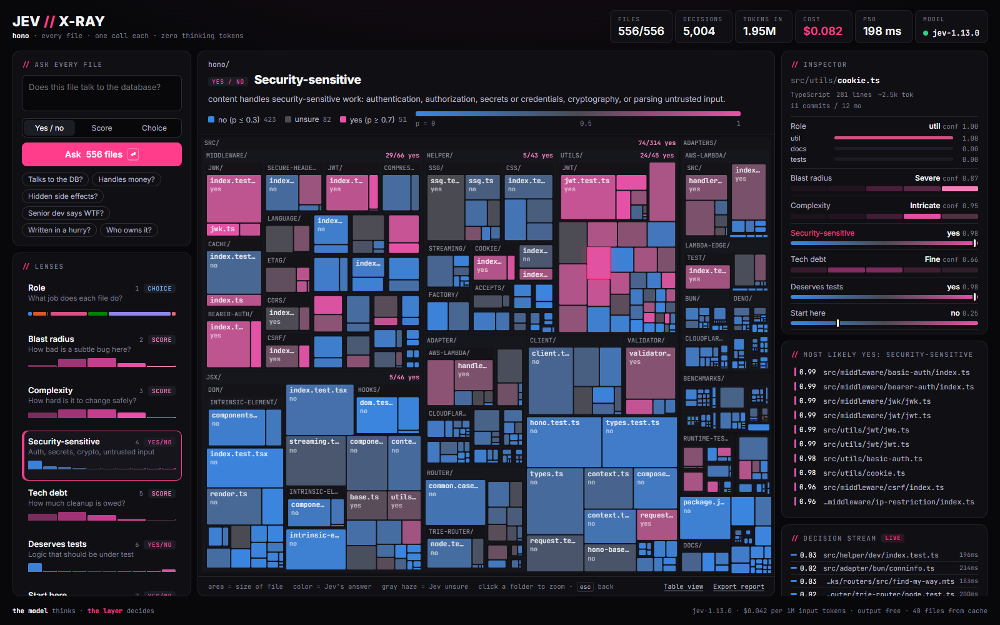
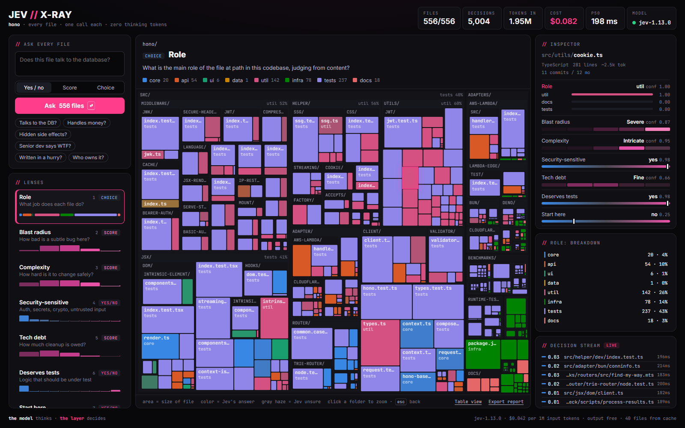
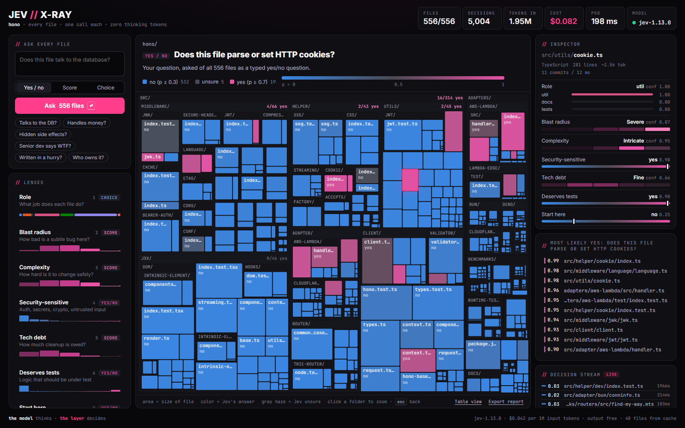
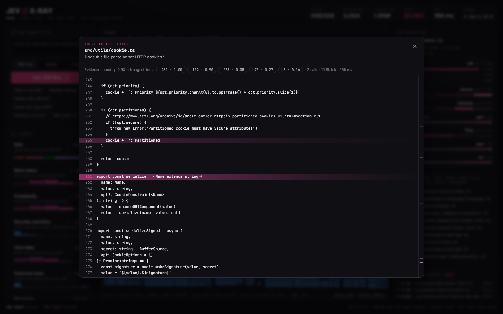
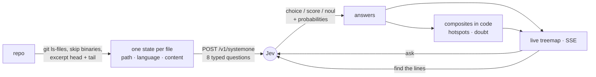

<p align="center">
  
</p>

<h1 align="center">jev-xray</h1>

<p align="center">
  <b>Ask every file in your repo a question at once. Watch the answer light up.</b><br>
  One typed <a href="https://typesafe.ai">Jev</a> call per file · calibrated probabilities · zero generated text
</p>

<p align="center">
  <code>node bin/jev-xray.js ~/code/your-repo</code>
</p>

---

`jev-xray` sends every file in a codebase to **Jev**, TypeSafe's System One decision model, together with a set of typed questions: *what role does this file play, how bad would a bug here be, does it touch secrets, should a newcomer read it first?* Jev does not write a paragraph back. Each answer is a **choice, a score, or a yes/no, with a calibrated probability**, and all questions for a file come back from one parallel pass.

Those answers become a live treemap of the repo. Switch lenses and the whole codebase recolors. Type a new question and watch 500 files relight in under a minute. Click a file and Jev points at the exact line.

> **LLMs generate. Agents execute. Jev decides.** A code map is thousands of small decisions nobody wants to pay a frontier model to think about one by one. That is exactly the workload a System One model is for.

Everything on this page is a real run against the live API: [honojs/hono](https://github.com/honojs/hono), 556 files, `jev-1.13.0`. **The full 8-lens scan took 30 seconds and cost $0.050.** (The GIF time-lapses the waiting parts about 3×.)

## What you get

| | |
|---|---|
|  |  |
| **Yes/no lenses** go blue → gray → pink. Gray means p ≈ 0.5: Jev is honestly unsure, so read that file yourself. | **Choice lenses** color each file by its answer. The faded tiles are low-confidence answers. |
|  |  |
| **Ask anything.** Your question becomes a new lens and streams across the repo live. | **Find the lines.** Jev ranks every line of the file and the code view lights up the evidence. |

### Built-in lenses

Every file gets all eight questions in a **single** Jev request.

| Lens | Type | The question Jev answers |
|---|---|---|
| Role | choice | core · api · ui · data · util · infra · tests · docs |
| Blast radius | score | If a subtle bug slipped in here, how much damage? *cosmetic → severe* |
| Complexity | score | How much care does a safe change need? *trivial → labyrinth* |
| Security-sensitive | yes/no | Auth, secrets, crypto, or parsing untrusted input? |
| Tech debt | score | *clean → rewrite candidate* |
| Deserves tests | yes/no | Real branching or parsing logic worth testing? |
| Start here | yes/no | Should a new contributor read this in their first hour? |
| Legacy | yes/no | Deprecated, abandoned, or mostly commented out? |

Two more are **computed in code** from those answers, never asked:

- **Hotspots**: `∛(blast radius × complexity × git churn)`, the classic "code as a crime scene" hotspot, using Jev's judgment where other tools use line counts. Colored by rank, so only the top of your repo glows.
- **Doubt**: `1 − mean confidence` across every answer for the file. Because Jev is trained for calibration, this is a real reading list, not noise.

## Quickstart

Requires Node 20+. No dependencies.

```bash
git clone https://github.com/viva-lee/jev-xray && cd jev-xray
cp .env.example .env                 # paste your key from console.typesafe.ai
node bin/jev-xray.js ~/code/your-repo
```

Bring your own key: jev-xray reads `TYPESAFE_API_KEY` (and optionally `JEV_MODEL`) from the environment or from a `.env` file in the directory you run it from (`--env path/to/.env` to point elsewhere). The key never leaves your machine except in requests to TypeSafe.

A browser opens on `localhost:4242` and the map fills in as answers land. The terminal prints the findings too. This is the real output for hono:

```text
  JEV // X-RAY v0.1.0  ~/code/hono
  556 files · ~498.7k tokens of code · git history found

  Hotspots  blast radius × complexity × churn
  ██████████████░░░░ 0.78  src/utils/jwt/jwt.ts  13 commits
  ██████████████░░░░ 0.78  src/types.ts  14 commits
  ██████████████░░░░ 0.78  src/utils/cookie.ts  11 commits

  Security-sensitive
  ██████████████████ 0.99  src/middleware/basic-auth/index.ts
  ██████████████████ 0.99  src/middleware/bearer-auth/index.ts
  ██████████████████ 0.99  src/middleware/jwk/jwk.ts

  Start here
  ████████████████░░ 0.87  src/index.ts
  ███████████████░░░ 0.83  README.md
  ███████████████░░░ 0.83  src/hono-base.ts

  jev-1.13.0  537 requests · 4,448 decisions · 1.20M input tokens · $0.050 · p50 199ms · 30.0s · 19 files from cache
  report → ~/code/hono/.jev-xray/xray.html
```

(19 files were byte-identical to others, so they were answered from the cache for free.)

No key yet? `node bin/jev-xray.js ~/code/your-repo --simulate` runs the whole UI on heuristic stand-in answers in Jev's response format, without calling the API. Every screen and report from that mode is stamped **SIMULATED**.

### Ask one question from the terminal

```bash
node bin/jev-xray.js ask "Does this file read from or write to the database?" ~/code/your-repo --top 10
node bin/jev-xray.js ask "Which team would own this?" . --type choice --options "web,api,platform,data"
node bin/jev-xray.js ask "How likely is this to break on a timezone change?" . --type score
```

That prints a ranked file list, so it works as a **semantic grep for coding agents**: "where is rate limiting implemented?" answered across the whole repo in one shot, for cents.

### Share it

Every run writes `.jev-xray/xray.html`, one self-contained file with the map, the answers, and every probability (file contents are not included). Open it anywhere or attach it to a PR. In the live view, **Export report** does the same. URLs carry state, e.g. `xray.html#lens=hotspot&zoom=src/auth`.

## How it works



- **One request per file, all questions at once.** Jev answers every question about a state in a single parallel pass, so eight lenses cost one call, not eight.
- **Excerpts, not whole files.** Jev's accuracy drops when long state is full of irrelevant detail, so large files are cut to their head and tail (`--max-tokens`, default 3,000).
- **Find the lines** follows TypeSafe's [line-by-line search](https://docs.typesafe.ai/cookbooks/semantic_find.md) recipe: tag lines `L0001…`, ask a choice over the tags plus a yes/no for "is any line evidence at all?", and split long files into 250-line windows judged in parallel.
- **Paced for the API.** 18 requests/s by default (the limit is 1,200/min), with backoff on `429`/`529` that slows the whole pipeline instead of letting every request hammer the API at once.
- **Cached.** Answers are keyed by file hash, question, and model in `.jev-xray/`. Re-running on an unchanged repo makes zero calls; after a commit, only changed files are re-asked.

### Cost and speed

Jev bills **$0.042 per million input tokens; output is free**. Measured on hono (556 files):

| | Requests | Input tokens | Cost | Wall time |
|---|---:|---:|---:|---:|
| Full scan, 8 lenses | 537 | 1.20M | **$0.050** | 30.0 s |
| One follow-up question, every file | 537 | ~0.74M | **~$0.031** | ~30 s |
| Find the lines in one 281-line file | 2 | 10.8k | $0.0005 | 0.27 s |
| Re-run on an unchanged repo | 0 | 0 | $0 | instant (cache) |

Median latency was 199 ms per request; wall time is set by the API's 1,200 requests/minute limit, not by the model. The live header shows billed usage as `usage.input_tokens` comes back.

## Custom lens packs

A lens is one typed question. Write your own pack and swap it in:

```bash
node bin/jev-xray.js . --lenses lenses/security-review.json
```

```jsonc
{
  "lenses": [
    {
      "key": "injection",
      "label": "Injection risk",
      "type": "score",                       // noul | score | choice
      "instructions": "How exposed is `content` to injection from data it does not control?",
      "criteria": ["None", "Low", "Medium", "High"]
    }
  ]
}
```

The state Jev sees has `path`, `language` and `content`, so instructions can point at them with backticks. Limits: up to 255 options per choice, 2–10 levels per score. The UI keeps up to 8 choice options in distinct colors and folds the rest into "other". [`lenses/security-review.json`](lenses/security-review.json) is a complete example.

## Reading the colors

The palettes are not eyeballed. Choice colors are a fixed 8-hue order validated for color-vision deficiency (adjacent pairs ΔE ≥ 8 under protanopia and deuteranopia simulation) against the dark surface. Scores use a single-hue ordinal ramp. Yes/no is diverging, with a **neutral gray midpoint that means "unsure"**, never a hue. Every value is also in the **Table view** (`t`), so nothing depends on color alone.

Keys: `1–9` switch lens · `/` ask · `t` table · click a folder header to zoom · `esc` back.

## Privacy and limits

- File excerpts are sent to the TypeSafe API. Point `--max-tokens` lower or use `.gitignore` to keep things out. Binaries, lockfiles, minified bundles, and files over 512 KB are skipped.
- Reports contain paths and answers, never file contents. The live server binds to `127.0.0.1` only and refuses cross-origin writes, so a web page you visit cannot spend your credits.
- Jev is a judgment model, not a calculator. Ask it semantic questions ("does this handle money?"), not counting questions ("how many functions?"). The counting is done in code.
- Answers are about excerpts. A 5,000-line file is judged on its head and tail.

## Media

The README media are produced by a script, not a screen recorder:

```bash
node bin/jev-xray.js <some-repo> --no-open --port 4330 &     # with your key in .env
node scripts/capture.mjs --url http://localhost:4330/ --out docs/media
```

It drives headless Chrome over the DevTools protocol (no Puppeteer), time-lapses the scan and the follow-up question until they finish, and needs `ffmpeg` on the path. `docs/media/hero.mp4` is the same recording as a small video for posting.

## Development

```bash
npm test                         # node:test, no dependencies
node bin/jev-xray.js . --simulate
```

```
bin/jev-xray.js    CLI: scan, ask, terminal summary
src/scan.js        file discovery, excerpts, git churn
src/jev.js         API client: pacing, retries, fatal auth errors
src/engine.js      runs lenses over files, cache, line drill-down
src/simulate.js    the --simulate stand-in (same response shapes)
src/server.js      local server: static UI, SSE, /api/ask, /api/lines
web/               canvas treemap UI (also inlined into reports)
lenses/            lens packs
```

---

<sub>Independent project, not affiliated with TypeSafe AI. Jev is TypeSafe's model; you need your own API key.</sub>
